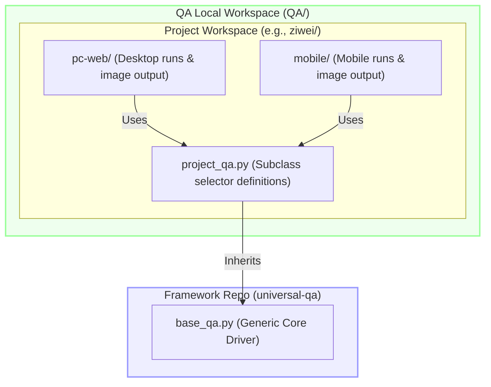

<p align="center">
  <h1 align="center">📷 Playwright Visual QA Framework</h1>
</p>

<p align="center">
  <em>A lightweight, highly decoupled, and project-agnostic visual QA & screenshot automation testing engine built on top of Playwright.</em>
</p>

<p align="center">
  
  
  
  
</p>

<p align="center">
  <a href="README.zh-CN.md"><b>简体中文</b></a> | <b>English</b>
</p>

---

## 🌟 Key Features

* **🔌 Project-Agnostic Core (`BaseQA`)**: Encapsulates browser setup, context isolation, responsive layouts, Safari/WebKit User-Agent injection, and logs aggregation.
* **⚡ Smart Anti-Shake Snapshotting**: Dynamic wait buffers (default `1500ms`) ensuring DOM layouts, interactive widgets, and complex WebGL/SVG animations settle before capture.
* **📱 Adaptive Viewports**: Effortlessly simulation of multiple viewport dimensions and device configurations.
* **🧱 Clean Separation Architecture**: Zero clutter. Framework repository contains only generic base classes, keeping project-specific logic and image outputs in local workspaces.

---

## 📂 Recommended Codebase Architecture

For clean scaling and team collaboration, we recommend separating the core framework module from your project-specific automation directories:



---

## 🚀 Quick Start

Here is a 3-step walk-through to implement visual QA for a project named `GoodTeam`.

### 1️⃣ Define your subclass `goodteam_qa.py`
Create a folder named `goodteam/` under your local `QA/` workspace, and inherit `BaseQA`:

```python
import sys
# Import the universal-qa directory
sys.path.append("/absolute/path/to/universal-qa")

from base_qa import BaseQA

class GoodTeamQA(BaseQA):
    def __init__(self, base_url="http://localhost:3000", out_dir="qa-screenshots", is_mobile=False, viewport=None):
        super().__init__(base_url, out_dir, is_mobile, viewport)

    def login(self, page, username, password):
        """Define customized login flow selectors"""
        page.fill("input[name='username']", username)
        page.fill("input[name='password']", password)
        page.click("button[type='submit']")
        self.wait(page, 1000) # Built-in smart pacing wait
```

### 2️⃣ Write the execution script `run_goodteam.py`
Create the runner script in `QA/goodteam/`:

```python
import sys
sys.path.append("/absolute/path/to/universal-qa")
sys.path.append("/absolute/path/to/QA/goodteam")

from goodteam_qa import GoodTeamQA
from playwright.sync_api import sync_playwright

# Setup for desktop visual QA
qa = GoodTeamQA(
    base_url="http://localhost:3000",
    out_dir="/absolute/path/to/QA/goodteam/screenshots-desktop",
    is_mobile=False
)

with sync_playwright() as p:
    browser = p.chromium.launch(headless=True)
    ctx = qa.create_context(browser)
    page = ctx.new_page()

    # Capture landing
    page.goto(qa.base_url)
    qa.shot(page, "01_landing_page")

    # Capture dashboard state after login
    qa.login(page, "admin", "password123")
    qa.shot(page, "02_dashboard")

    ctx.close()
    browser.close()
    
    # Print results summary
    qa.list_results()
```

### 3️⃣ Setup Environment & Run
```bash
pip install playwright
playwright install
python run_goodteam.py
```

---

## 🛠️ BaseQA API Reference

| API Method | Parameters | Description |
| :--- | :--- | :--- |
| `__init__` | `base_url`, `out_dir`, `is_mobile`, `viewport` | Initializes target URL, output folders, responsive setups, and UA injections. |
| `create_context(browser)` | `browser` | Returns a Playwright BrowserContext populated with custom viewports and User-Agents. |
| `shot(page, name, full=True)` | `page`, `name`, `full` | Takes a screenshot after a short debounce to allow layout/render settling. Supports full-page scrolling. |
| `wait(page, ms=800)` | `page`, `ms` | Synchronously pauses the flow for the specified milliseconds to control page pacing. |
| `list_results()` | None | Scans the output directory and logs all `.png` files along with their file sizes in KB. |

---

## ⚠️ Safety & Environment Requirements

> [!WARNING]
> Automated visual QA scripts simulate actual click events and form submissions. Please ensure the following constraints are followed to avoid **unintentional billing charges** or **security leaks**:

### 💰 API Cost & LLM Protection
* **Avoid High-Cost Billing APIs in CI**: If your UI workflows trigger backend calls to costly Third-Party APIs (such as Large Language Model APIs, paid geocoders, etc.), running these QA suites on high-frequency CI pipelines might quickly exhaust your API quotas and cause unexpectedly high bills.
* **Mock Responses in Development**: For local visual/UI regressions, strongly consider mocking expensive API endpoints on the server/network-interceptor layer or switching to cheaper test-only credentials.

### 🔒 Sandbox Credentials & Auth
* **Use Dedicated Test Credentials**: When testing authenticated states (e.g., Clerk, Auth0, Okta), configure mock accounts in your test database. **Never hardcode real administrator or customer passwords**.
* **Bypass Defensive Guardrails**: Executing raw Playwright scripts on real production setups might trigger Cloudflare Rate Limiting, CAPTCHAs, or IP bans. These scripts are exclusively recommended for **local development servers or Staging sandboxes**.

### 🚫 No Write Operations in Production
* If your subclass flows trigger write operations (such as deleting items, submitting real order invoices, etc.), always implement a domain check. If a production URL is detected, raise an exception to halt the script instantly.

---

## 📄 License

This project is licensed under the MIT License - see the [LICENSE](LICENSE) file for details.
