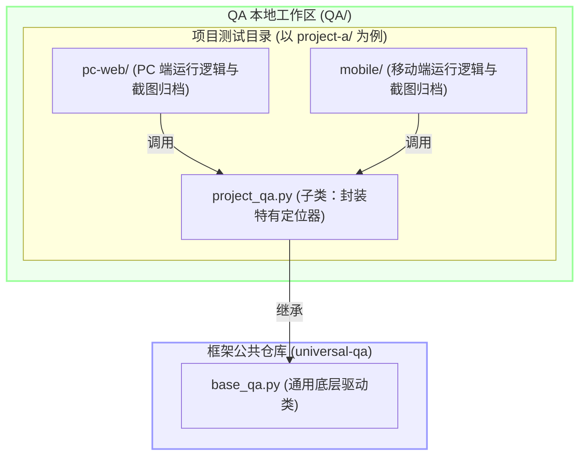

<p align="center">
  <h1 align="center">📷 Playwright 视觉 QA 自动化测试框架</h1>
</p>

<p align="center">
  <em>基于 Playwright 的轻量级、高度解耦且项目无关的 Web 视觉回归测试与截图自动化引擎。</em>
</p>

<p align="center">
  
  
  
  
</p>

<p align="center">
  <b>简体中文</b> | <a href="README.md"><b>English</b></a>
</p>

---

## 🌟 核心特性

* **🔌 通用基础类 (`BaseQA`)**：封装了 Playwright 的浏览器启动、上下文配置、多端响应式仿真、防抖截图和日志汇总等基础底座能力。
* **⚡ 智能防抖快照 (`shot`)**：内置页面渲染微等待机制（默认 `1500ms`），确保复杂的图表、WebGL 动画以及布局重排完全稳定后再执行捕获，防止生成空白或错位的图片。
* **📱 多分辨率/设备自适应**：轻松支持 PC 端分辨率配置及移动端仿真（自动调整视口宽高，注入标准的 Safari/WebKit 移动端 User-Agent）。
* **🧱 完全松耦合架构**：将自动化框架库本身与特定项目的业务测试脚本、生成的测试图片完全分离开，保持框架仓库代码纯净。

---

## 📂 推荐的代码库组织结构

为了使框架本身的仓库保持干净，方便持续维护和跨项目复用，建议在工作区中采用如下的代码结构设计：



## 📦 安装指引

您现在可以直接将此框架作为本地 Python 第三方库安装，方便您在任何测试项目中全局直接 `import` 引用 `BaseQA` 或 `universal_qa` 模块，无需再在脚本里编写繁琐的 `sys.path.append` 代码：

```bash
# 以可编辑模式本地安装（推荐，便于框架代码实时生效）
pip install -e .
```

---

## 🚀 快速上手

以在 `QA/` 工作区下为 `MyProject` 项目快速编写一套视觉测试为例，仅需 3 步：

### 1️⃣ 创建项目专属业务类 `project_qa.py`
在本地的 `QA/` 目录下创建 `project_qa` 文件夹，并继承通用基类 `BaseQA`：

```python
import sys
# 引入通用框架目录的路径
sys.path.append("/path/to/universal-qa")

from base_qa import BaseQA

class ProjectQA(BaseQA):
    def __init__(self, base_url="http://localhost:3000", out_dir="qa-screenshots", is_mobile=False, viewport=None):
        super().__init__(base_url, out_dir, is_mobile, viewport)

    def login(self, page, username, password):
        """项目特有的登录业务流与选择器"""
        page.fill("input[name='username']", username)
        page.fill("input[name='password']", password)
        page.click("button[type='submit']")
        self.wait(page, 1000) # 调用基类自带的等待方法
```

### 2️⃣ 编写测试执行脚本 `run_project.py`
在 `QA/project_qa/` 下创建启动脚本进行串联：

```python
import sys
sys.path.append("/path/to/universal-qa")
sys.path.append("/path/to/QA/project_qa")

from project_qa import ProjectQA
from playwright.sync_api import sync_playwright

# 实例化 PC 端视觉 QA 配置
qa = ProjectQA(
    base_url="http://localhost:3000",
    out_dir="/path/to/QA/project_qa/screenshots-desktop",
    is_mobile=False
)

with sync_playwright() as p:
    browser = p.chromium.launch(headless=True)
    ctx = qa.create_context(browser)
    page = ctx.new_page()

    # 1. 截取 Landing 页面
    page.goto(qa.base_url)
    qa.shot(page, "01_landing_page")

    # 2. 截取登录后的仪表盘
    qa.login(page, "admin", "password123")
    qa.shot(page, "02_dashboard")

    ctx.close()
    browser.close()
    
    # 统计并打印最终生成的截图结果
    qa.list_results()
```

### 3️⃣ 安装依赖并运行
```bash
pip install playwright
playwright install
python run_project.py
```

---

## 🛠️ BaseQA API 参考文档

子类可以直接继承并调用 `BaseQA` 的以下高复用方法：

| API 方法 | 接收参数 | 详细说明 |
| :--- | :--- | :--- |
| `__init__` | `base_url`, `out_dir`, `is_mobile`, `viewport` | 初始化测试的目标域名、截图输出文件夹、响应式视口大小以及 UA 移动端注入。 |
| `create_context(browser)` | `browser` (Browser) | 传入 Playwright 浏览器实例，返回配置好分辨率和移动端伪装的 `BrowserContext`。 |
| `shot(page, name, full=True)` | `page` (Page), `name` (str), `full` (bool) | 进行网页截图。内置渲染防抖，支持长网页滚动截屏。 |
| `wait(page, ms=800)` | `page` (Page), `ms` (int) | 控制交互节奏的暂停等待（单位：毫秒）。 |
| `list_results()` | 无 | 扫描输出文件夹，统计生成的 `.png` 文件个数并在控制台输出包含文件大小（KB）的列表。 |

### 📱 内置机型与分辨率预设别名 (Built-in Presets)

在配置运行环境（使用 `QAConfig` 或初始化 `BaseQA`）时，您可以通过直接指定 `device` 别名，来自动加载精确的视口宽高、设备像素比（DPI）以及原生的触摸屏和移动端仿真参数：

| 预设别名 (Alias) | 对应仿真目标设备 | 对应分辨率 / 视口宽高 | 设备类型 |
| :--- | :--- | :--- | :--- |
| `desktop` | 普通 PC 桌面端 | 1280 x 800 | 桌面电脑 |
| `desktop_1080p`| 1080P 高清显示器 | 1920 x 1080 | 桌面电脑 |
| `iphone` | iPhone 12 | 390 x 844 | 手机 (支持触屏) |
| `iphone_se` | iPhone SE | 375 x 667 | 手机 (支持触屏) |
| `iphone_pro_max`| iPhone 14 Pro Max | 430 x 932 | 手机 (支持触屏) |
| `android` | Google Pixel 5 | 393 x 851 | 手机 (支持触屏) |
| `android_large`| Samsung Galaxy S9+ | 360 x 740 | 手机 (支持触屏) |
| `ipad` | iPad Mini | 768 x 1024 | 平板 (支持触屏) |
| `ipad_pro` | iPad Pro 11 | 834 x 1194 | 平板 (支持触屏) |

同时，您也可以将 Playwright 官方支持的任何标准设备名称（如 `"iPhone 14 Pro Max"`、`"iPad Pro 11"`）直接传给 `device` 参数来动态加载配置。

---

## ⚠️ 运行前置安全与环境要求

> [!WARNING]
> 自动化测试脚本因为会模拟真实的点击和表单提交，在运行前请务必确认满足以下安全要求，以防止**高昂的 API 费用账单**或**敏感数据泄露**：

### 💰 接口成本保护与额度防护 (LLM & Billing Cost Protection)
* **避免对高成本 API 或大语言模型接口进行高频并发测试**：如果交互脚本中涉及调用大语言模型（LLM）接口、复杂云计算或其他按量计费的第三方 API，在持续集成（CI）的高频触发或并发脚本中运行测试可能在短时间内消耗大量的 API 额度，产生高昂账单。
* **开发环境推荐进行 Mock 拦截**：在本地开发验证或日常 UI 测试时，强烈建议在后端服务或网络拦截层将这些高成本接口的响应进行 Mock，或者在测试环境中切换到低成本的开发模型（如小参数本地模型）作为出口。

### 🔒 认证与验证码规避 (Auth & Security)
* **使用专属的 QA/Test 账号**：进行第三方认证登录（如 Clerk/Auth0）的自动化测试时，请在测试数据库中为其注册专门的 QA 账号。**严禁使用任何真实的生产管理员/用户账号**进行自动化模拟。
* **规避防刷机制（Rate Limit / CAPTCHA）**：在生产环境中运行此脚本可能会因为高频点击或无 Cookie 访问，直接触发 Cloudflare 等安全防护机制或 IP 封禁。因此，此脚本**仅建议在不受防御限制的本地开发机或专用 Staging 环境中执行**。

### 🚫 严禁对生产环境执行写操作
* 在编写子类逻辑时，如果涉及付款支付、删除数据、修改设置等敏感写入动作，**必须在执行前判断是否处于生产域名**。如果检测到生产 URL，应立即中止并抛出异常，防止污染真实生产业务。

---

## 📄 开源许可证

本项目基于 MIT 许可证开源 - 详见 [LICENSE](LICENSE) file for details。
